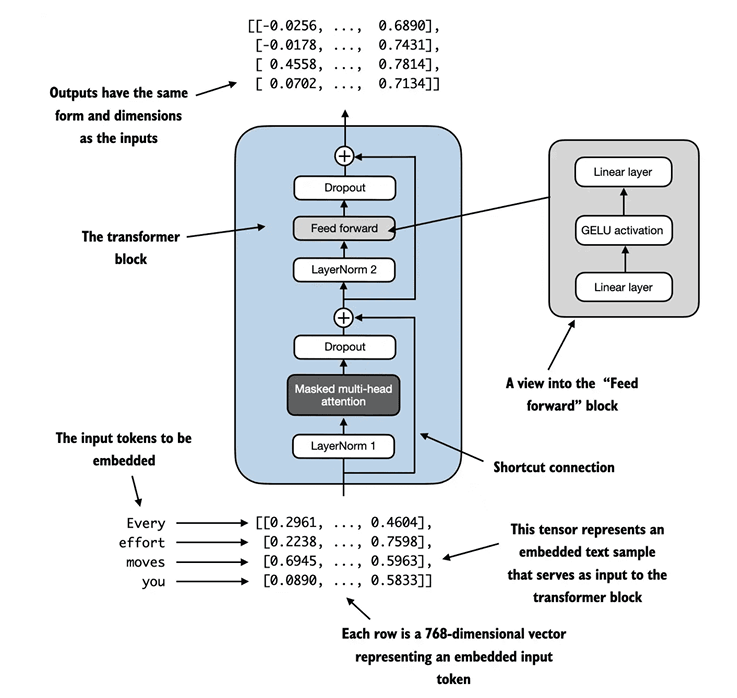
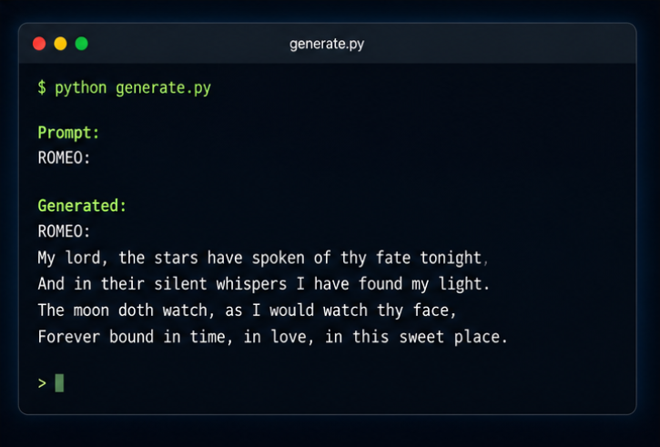

<div align="center">

# 🤖 GPT-2 From Scratch

### Building a Decoder-Only Transformer Language Model using PyTorch


</div>

---

<p align="center">
  
</p>

---

## 🚀 Overview

This project implements a **GPT-style Transformer Language Model completely from scratch** using PyTorch.

Instead of relying on existing frameworks such as Hugging Face Transformers, every major component is implemented manually to understand how modern Large Language Models work internally.

### Key Concepts Implemented

✅ Tokenization using Tiktoken

✅ Token & Positional Embeddings

✅ Multi-Head Self Attention

✅ Feed Forward Networks

✅ Layer Normalization

✅ Residual Connections

✅ Causal Masking

✅ Autoregressive Text Generation

---

# 🏗️ Transformer Architecture

<p align="center">
  
</p>

---

# 🧠 GPT Architecture

<p align="center">
  
</p>

### Model Flow

```text
Input Text
    ↓
Tokenizer (tiktoken)
    ↓
Token IDs
    ↓
Token Embeddings
        +
Positional Embeddings
    ↓
Transformer Blocks
    ↓
Linear Head
    ↓
Vocabulary Logits
    ↓
Next Token Prediction
```

---

# 📂 Project Structure

```bash
gpt2-from-scratch/
│
├── assets/
│   ├── architecture.png
│   ├── banner.png
│   ├── sample_generation.png
│   ├── training.png
│   └── transformer.png
│
├── data/
│   └── input.txt
│
├── tokenizer.py
├── dataset.py
├── model.py
├── train.py
├── generate.py
│
├── gpt.pt
├── requirements.txt
└── README.md
```

---

# ⚙️ Installation

Clone the repository:

```bash
git clone https://github.com/pritam1952/gpt2-from-scratch.git

cd gpt2-from-scratch
```

Create a virtual environment:

```bash
python -m venv venv
```

### Windows

```bash
venv\Scripts\activate
```

### Linux / Mac

```bash
source venv/bin/activate
```

Install dependencies:

```bash
pip install -r requirements.txt
```

---

# 📚 Dataset

Place your training corpus inside:

```text
data/input.txt
```

Supported datasets:

- Shakespeare
- TinyStories
- WikiText
- Custom text corpora

---

# ⚡ Training

Train the model:

```bash
python train.py
```

Example configuration:

```python
GPT_CONFIG = {
    "vocab_size": 50257,
    "context_length": 32,
    "emb_dim": 32,
    "n_heads": 2,
    "n_layers": 1,
    "drop_rate": 0.1,
    "qkv_bias": False
}
```

Model checkpoints are saved as:

```bash
gpt.pt
```

---

# 📈 Training Results

<p align="center">
  
</p>

The training loss decreases steadily, indicating successful learning of language patterns from the dataset.

---

# 🎯 Text Generation

Generate text using the trained model:

```bash
python generate.py
```

---

# 📝 Sample Output

<p align="center">
  
</p>

Example:

```text
Prompt:

ROMEO:

Generated:

ROMEO:
My lord, the stars have spoken of thy fate tonight...
```

---

# 🔬 Learning Objectives

This project was built to deeply understand:

- Transformer Architecture
- Self-Attention Mechanism
- Decoder-Only Models
- GPT Training Pipeline
- Language Modeling
- Tokenization
- PyTorch Internals

---

# 🚧 Future Improvements

- GPT-2 124M Replica
- Larger Context Length
- Flash Attention
- Mixed Precision Training
- LoRA Fine-Tuning
- GPU Optimization
- Model Evaluation Benchmarks
- Hugging Face Compatibility

---

# 🛠️ Tech Stack

| Technology | Purpose |
|------------|---------|
| Python | Programming Language |
| PyTorch | Deep Learning Framework |
| Tiktoken | Tokenization |
| NumPy | Numerical Computing |

---

# ⭐ Repository Stats

If you found this project useful, consider giving it a star.

```bash
⭐ Star the repo
🍴 Fork the project
🚀 Build your own GPT
```

---

<div align="center">

## 👨‍💻 Author

### Pritam Kumar

[GitHub Profile](https://github.com/pritam1952)

Building Large Language Models from First Principles.

</div>
