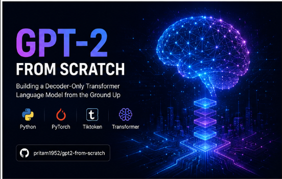
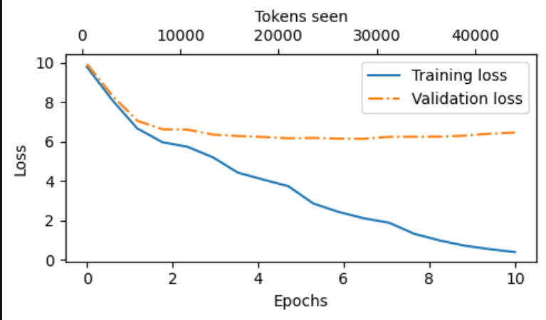
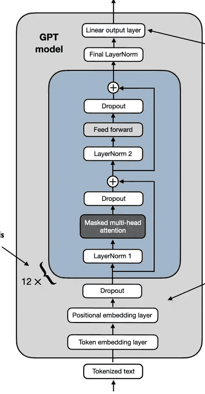

<div align="center">

# 🤖 GPT-2 From Scratch

### Building a Decoder-Only Transformer from the Ground Up using PyTorch




</div>

---

## 🚀 Overview

This project implements a **GPT-style Transformer Language Model** completely from scratch using **PyTorch**.

The goal is to understand every component of a modern LLM:

- Tokenization
- Embeddings
- Self-Attention
- Multi-Head Attention
- Feed Forward Networks
- Layer Normalization
- Residual Connections
- Autoregressive Generation

No HuggingFace model is used.

---

# 📸 Demo

## Training



---

## Text Generation

```text
Prompt:

ROMEO:

Generated:

ROMEO:
My lord, the stars have spoken of thy fate tonight...
```

---

# 🏗️ Architecture



### Model Flow

```text
Input Text
    ↓
Tokenizer
    ↓
Token IDs
    ↓
Embeddings
    ↓
Transformer Blocks
    ↓
Linear Head
    ↓
Next Token Prediction
```

---

# 📂 Project Structure

```bash
gpt2-from-scratch/
│
├── data/
│   └── input.txt
│
├── tokenizer.py
├── dataset.py
├── model.py
├── train.py
├── generate.py
│
├── gpt.pt
├── requirements.txt
└── README.md
```

---

# ⚙️ Installation

```bash
git clone https://github.com/pritam1952/gpt2-from-scratch.git

cd gpt2-from-scratch

python -m venv venv
```

### Windows

```bash
venv\Scripts\activate
```

### Linux / Mac

```bash
source venv/bin/activate
```

Install dependencies:

```bash
pip install -r requirements.txt
```

---

# 📚 Dataset

Place your corpus in:

```bash
data/input.txt
```

Supported datasets:

- Shakespeare
- TinyStories
- WikiText
- Custom datasets

---

# 🧠 Model Configuration

```python
GPT_CONFIG = {
    "vocab_size": 50257,
    "context_length": 32,
    "emb_dim": 32,
    "n_heads": 2,
    "n_layers": 1,
    "drop_rate": 0.1,
    "qkv_bias": False
}
```

---

# 🏋️ Training

```bash
python train.py
```

Training saves:

```bash
gpt.pt
```

---

# 🎯 Generate Text

```bash
python generate.py
```

Example:

```text
Prompt:
To be, or not to be

Output:
To be, or not to be that is the question...
```

---

# 📈 Training Results

| Epoch | Loss |
|---------|---------|
| 1 | 4.23 |
| 2 | 3.78 |
| 3 | 3.41 |

---

# 🔬 What I Learned

✅ Transformer Architecture

✅ Self-Attention

✅ Multi-Head Attention

✅ GPT Training Pipeline

✅ Language Modeling

✅ PyTorch Internals

---

# 🚧 Future Improvements

- GPT-2 124M Replica
- Flash Attention
- Mixed Precision Training
- GPU Optimization
- Fine-Tuning Pipeline
- LoRA Support
- Evaluation Benchmarks

---

# 🛠️ Tech Stack

| Tool | Usage |
|--------|--------|
| Python | Core Language |
| PyTorch | Deep Learning |
| Tiktoken | Tokenization |
| NumPy | Data Processing |

---

# 🌟 Star History

If you like this project, consider giving it a ⭐

---

<div align="center">

## 👨‍💻 Author

### Pritam Kumar

<a href="https://github.com/pritam1952">

</a>

</div>
